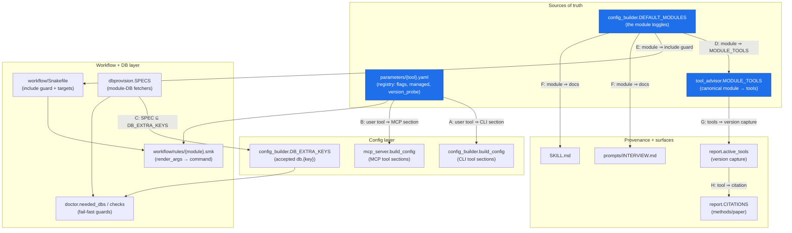
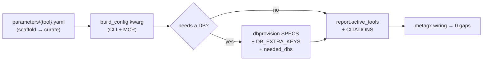
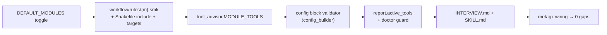
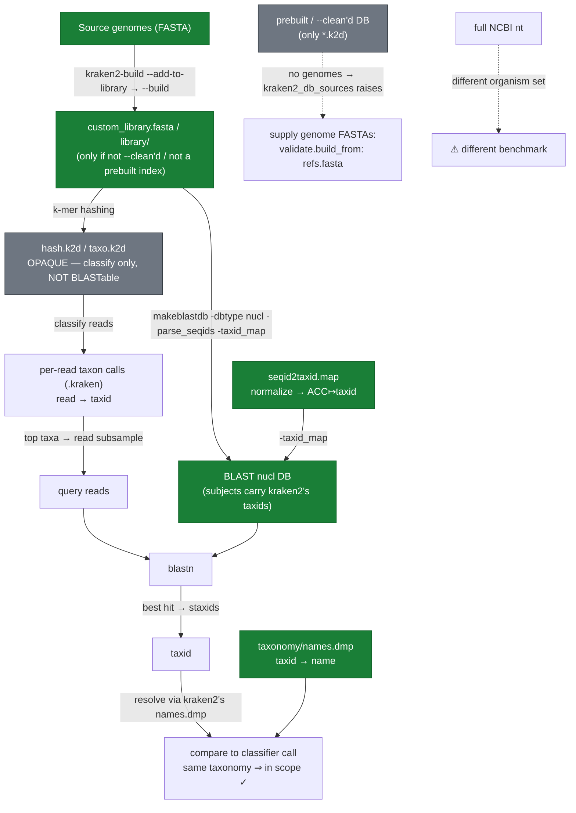
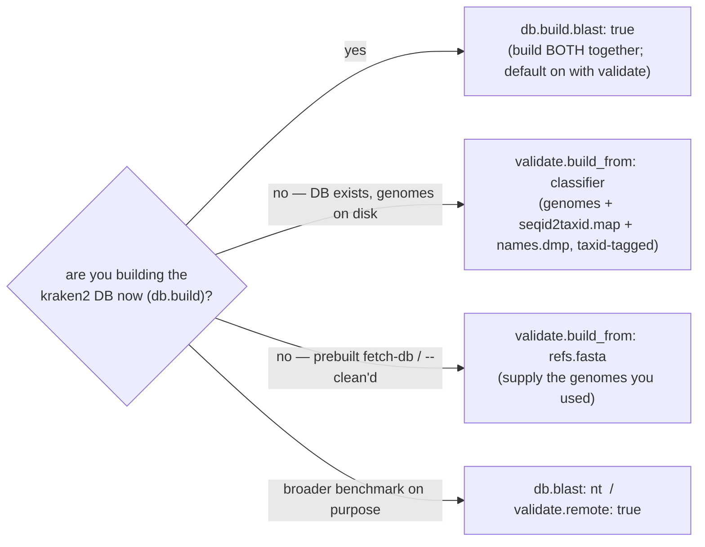

# metagx wiring — the mental map (and how the validation reference stays in scope)

This is the visual companion to `metagx/wiring.py` (run `metagx wiring`). It shows **every moving
part a tool or module touches**, so adding one and forgetting another is caught — by the audit, not
by memory. Part 2 answers a specific question: *how does blastn validate against the same references
as kraken2, and what does kraken2 actually expose?*

---

## Part 1 — The wiring DAG

A tool/module is wired across many independently-defined parts. The **single sources of truth** are
the per-tool registries (`parameters/*.yaml`), `DEFAULT_MODULES`, and `tool_advisor.MODULE_TOOLS`;
everything else consumes them. `metagx wiring` cross-checks each edge and fails on any gap.



**The labelled edges are the audit invariants** (A–H in `wiring.audit()`):

| Edge | Invariant | What a gap means |
|------|-----------|------------------|
| **A** | every registry *user* tool is a `build_config` kwarg (CLI) | a tool you can't actually configure |
| **B** | …and a `mcp_server.build_config` kwarg (MCP) | CLI and web/MCP surfaces drifted |
| **C** | every `dbprovision.SPECS` key ∈ `config_builder.DB_EXTRA_KEYS` | a provisioner whose `db.<key>` path the config rejects |
| **D** | every module ∈ `tool_advisor.MODULE_TOOLS` | `recommend`/`advise` blind to the module's tools |
| **E** | every module referenced in `workflow/Snakefile` | a toggle that includes no rule |
| **F** | every module documented in INTERVIEW.md **and** SKILL.md | the interview can't ask for it |
| **G** | each enabled module's tools appear in `report.active_tools` | tool version missing from the provenance manifest |
| **H** | every captured tool has a `report.CITATIONS` entry | methods/paper can't cite it |

> `kraken2-build`/`bracken-build` are DB-construction tools, not user sections (excluded from A/B).
> Routing modules (qc/assembly/phylogenetics/…) resolve tools per-platform, so G is checked over a
> kitchen-sink config. The MCP edge (B) is parsed from source with `ast`, so the audit runs even
> without the optional `mcp` extra installed.

### Adding a TOOL — the checklist the DAG enforces



### Adding a MODULE — the checklist the DAG enforces



---

## Part 2 — How blastn validates against the *same references* as kraken2

**kraken2 and blastn are separate tools with incompatible DB formats. kraken2 does NOT keep a
BLAST-ready database, and it makes no promise to.** A kraken2 DB is an opaque k-mer hash
(`hash.k2d`/`opts.k2d`/`taxo.k2d`) — `file hash.k2d` → `data`. It stores *k-mers → taxon*, not
retrievable sequences, so **blastn cannot read it at all**. They can only be kept *in sync* by
sharing the **source genomes** and the **same taxid mapping** — and that is only possible when those
inputs are still on disk.

### Two things blastn needs that kraken2 does not hand over for free

**(a) The genomes — and they're not always there.** Whether the source FASTAs survive depends on how
the kraken2 DB was made:

| How the kraken2 DB was built | genomes on disk? | in-sync BLAST DB? |
|---|---|---|
| metagx `db.build` custom-fasta/folder/spike-in | **yes** — `custom_library.fasta` | ✅ build from it |
| `kraken2-build --download-library …` (standard), **not** `--clean`'d | **yes** — `library/**/library.fna` | ✅ build from it |
| `kraken2-build … --clean` (space-saving) | **no** — only `*.k2d` | ❌ supply genomes yourself |
| prebuilt index from `fetch-db` (the compact tarball) | **no** — only `*.k2d`(+map) | ❌ supply genomes yourself |

So "build blastn from kraken2's library" works for the first two and **fails for the rest** —
`validation.kraken2_db_sources()` raises a clear error telling you to pass the genome FASTAs.

**(b) The taxonomy — blastn is taxid-blind unless you tell it.** A plain `makeblastdb` DB has **no
taxids**; `blastn`'s `staxids`/`sscinames` come up empty (`N/A`) unless you both (i) pass a
`-taxid_map` (`accession → taxid`) at build time, and (ii) install NCBI's `taxdb` for name lookup.
kraken2 already holds the mapping in **`seqid2taxid.map`** and the names/tree in **`taxonomy/names.dmp`
+ `nodes.dmp`** (its own — synthetic for a custom build, real NCBI for a standard one). The in-sync
trick is to **reuse kraken2's own taxonomy**: feed its `seqid2taxid.map` to `makeblastdb` so the BLAST
subjects carry kraken2's *exact* taxids, then resolve names through kraken2's *own* `names.dmp` — so
the agreement check is **taxid → name in one taxonomy**, with no dependency on NCBI's `taxdb`.

> ⚠️ **Gotcha (empirically found):** kraken2's `seqid2taxid.map` does **not** work verbatim — its keys
> are the full internal seqid `ACC|kraken:taxid|N`, but `makeblastdb -taxid_map` matches the *bare*
> accession, so it errors *"No sequences matched any of the taxids provided."* It must be normalized
> to `ACC → taxid` first (`validation.normalize_seqid2taxid`).

### What kraken2 actually writes (verified on `local_databases/viral_custom`)

```
viral_custom/
├── hash.k2d              ← OPAQUE: minimizer → taxon hash   (file → "data"; NOT BLASTable)
├── opts.k2d  taxo.k2d    ← build options + taxonomy tree (binary)
├── custom_library.fasta  ← the GENOMES kraken2 ingested  (>NC_…|kraken:taxid|N …)   ← shareable
├── library/added/*.fna   ← same sequences (only present if not --clean'd)            ← shareable
├── seqid2taxid.map       ← "NC_001477.1|kraken:taxid|1001 ⇥ 1001"  (NORMALIZE before makeblastdb)
└── taxonomy/names.dmp,nodes.dmp  ← taxid → name + tree (in-sync name source; no NCBI taxdb needed)
```



### Empirical validation (what I ran — you can re-run it)

```bash
K2=local_databases/viral_custom

# (1) the genomes kraken2 ingested are on disk as FASTA (custom build):
grep -c '^>' $K2/custom_library.fasta                 # → 30 genomes

# (2) kraken2's map does NOT work verbatim:
makeblastdb -in $K2/custom_library.fasta -dbtype nucl -parse_seqids \
            -taxid_map $K2/seqid2taxid.map -out /tmp/db1
#   → Error: [makeblastdb] No sequences matched any of the taxids provided

# (3) normalized ACC→taxid works → subjects carry kraken2's EXACT taxids:
awk -F'\t' '{split($1,a,"|"); print a[1]"\t"$2}' $K2/seqid2taxid.map > /tmp/acc2taxid.tsv
makeblastdb -in $K2/custom_library.fasta -dbtype nucl -parse_seqids \
            -taxid_map /tmp/acc2taxid.tsv -out /tmp/db2
blastdbcmd -db /tmp/db2 -entry all -outfmt '%a %T' | head -1   # → NC_001477.1|… 1001

# (4) a real read returns kraken2's taxid, resolved by kraken2's OWN names.dmp:
#   blastn … -outfmt '6 … staxids …'  → staxids = 1004
grep -P '^1004\t' $K2/taxonomy/names.dmp              # → 1004 | Yellow fever virus | … | scientific name
```

Result: `staxids = 1004` (kraken2's synthetic taxid) → `names.dmp` → *Yellow fever virus* — a
**taxid-to-taxid** match in one taxonomy, no NCBI `taxdb` involved.

### How metagx wires this for you

- **`db.build.blast: true`** (CLI `--with-blast`) — **best when you're building the classifier DB
  anyway.** `build_aligned_blast_db` runs `makeblastdb` (with the normalized taxid map) **in the same
  `db.build` step, right after kraken2-build** — while the library genomes are guaranteed present,
  before any clean — and sets `db.blast`. Defaults ON when `modules.validate` is enabled.
- `validate.build_from: classifier` — for an already-built kraken2 DB on disk: resolve its genomes +
  `seqid2taxid.map` + `names.dmp` and build the aligned DB on the fly (`build_validate_blast_db`).
- `validate.build_from: <FASTA|folder>` — you supply the genomes (**required** for a prebuilt/
  `--clean`'d index, which ships none). Comparison falls back to the subject title.
- `db.blast: <path>` / `validate.remote: true` — only when you *deliberately* want a broader
  reference (e.g. nt). That is a different benchmark, by design.



> ⚠️ **Do not `kraken2-build --clean` if you want to validate later** — it deletes the library
> genomes blastn needs. metagx's `db.build` never cleans; `metagx doctor` STRONG-warns if you build
> a kraken2 DB for validation without the aligned BLAST DB.
>
> **Limit (next pass):** for a `--clean`'d or prebuilt-fetched index there are genuinely no genomes
> on disk; auto **re-download** by accession is a future pass — until then supply
> `validate.build_from: <FASTA>`. Tracked in the ROADMAP.

---

*Keep this in sync with `metagx/wiring.py`. If you change an invariant there, update Part 1 here;*
*`metagx wiring` is the executable version of this picture.*
