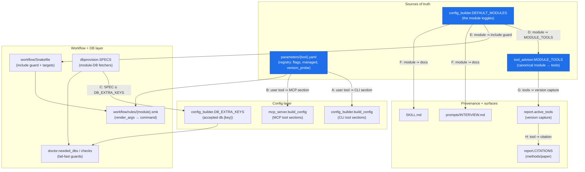
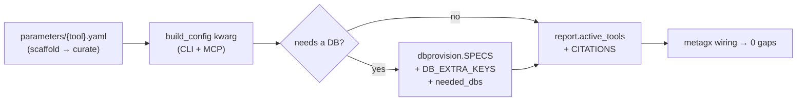
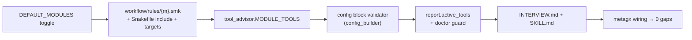
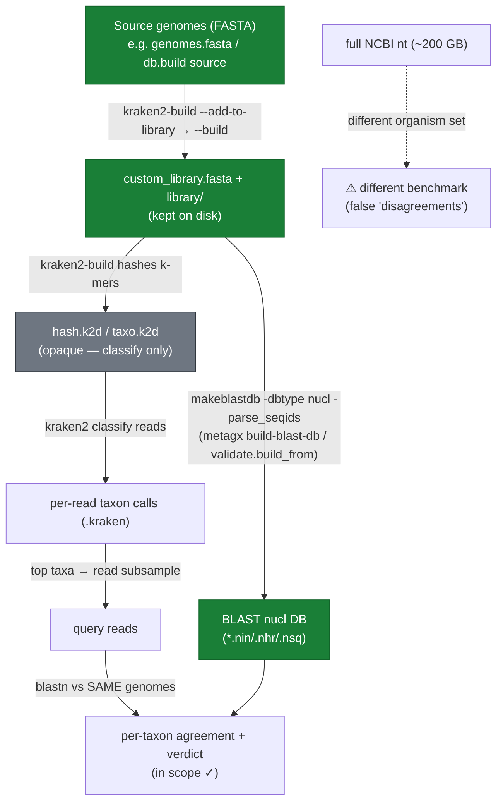
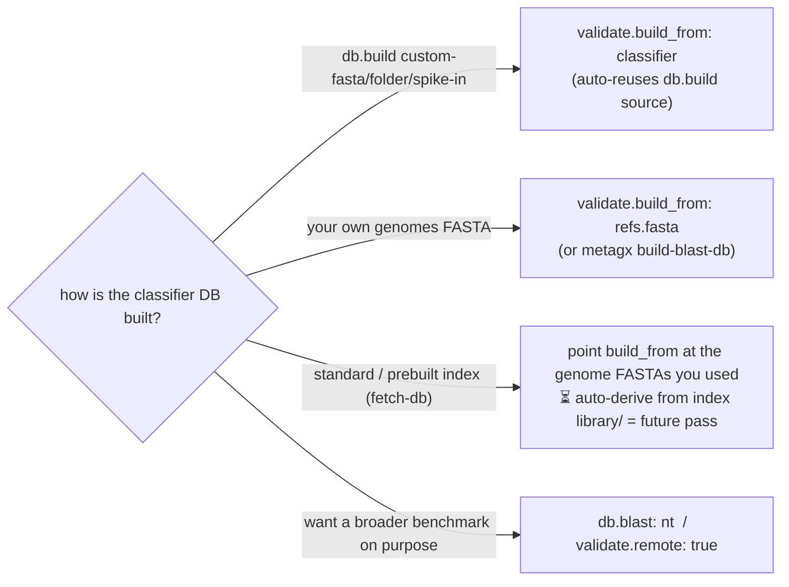

# metagx wiring — the mental map (and how the validation reference stays in scope)

This is the visual companion to `metagx/wiring.py` (run `metagx wiring`). It shows **every moving
part a tool or module touches**, so adding one and forgetting another is caught — by the audit, not
by memory. Part 2 answers a specific question: *how does blastn validate against the same references
as kraken2, and what does kraken2 actually expose?*

---

## Part 1 — The wiring DAG

A tool/module is wired across many independently-defined parts. The **single sources of truth** are
the per-tool registries (`parameters/*.yaml`), `DEFAULT_MODULES`, and `tool_advisor.MODULE_TOOLS`;
everything else consumes them. `metagx wiring` cross-checks each edge and fails on any gap.



**The labelled edges are the audit invariants** (A–H in `wiring.audit()`):

| Edge | Invariant | What a gap means |
|------|-----------|------------------|
| **A** | every registry *user* tool is a `build_config` kwarg (CLI) | a tool you can't actually configure |
| **B** | …and a `mcp_server.build_config` kwarg (MCP) | CLI and web/MCP surfaces drifted |
| **C** | every `dbprovision.SPECS` key ∈ `config_builder.DB_EXTRA_KEYS` | a provisioner whose `db.<key>` path the config rejects |
| **D** | every module ∈ `tool_advisor.MODULE_TOOLS` | `recommend`/`advise` blind to the module's tools |
| **E** | every module referenced in `workflow/Snakefile` | a toggle that includes no rule |
| **F** | every module documented in INTERVIEW.md **and** SKILL.md | the interview can't ask for it |
| **G** | each enabled module's tools appear in `report.active_tools` | tool version missing from the provenance manifest |
| **H** | every captured tool has a `report.CITATIONS` entry | methods/paper can't cite it |

> `kraken2-build`/`bracken-build` are DB-construction tools, not user sections (excluded from A/B).
> Routing modules (qc/assembly/phylogenetics/…) resolve tools per-platform, so G is checked over a
> kitchen-sink config. The MCP edge (B) is parsed from source with `ast`, so the audit runs even
> without the optional `mcp` extra installed.

### Adding a TOOL — the checklist the DAG enforces



### Adding a MODULE — the checklist the DAG enforces



---

## Part 2 — How blastn validates against the *same references* as kraken2

**Short answer:** they don't share a database file — they share the **source genomes**. kraken2's
built DB is an opaque k-mer hash you cannot BLAST. But kraken2-build leaves the genomes it ingested
on disk as plain FASTA, and we run `makeblastdb` on **that same FASTA**. Same input genomes ⇒ both
tools cover the same organism set ⇒ the BLAST cross-check is a fair, in-scope benchmark.

### What kraken2 actually writes (verified on `local_databases/viral_custom`)

```
viral_custom/
├── hash.k2d              ← OPAQUE binary: minimizer → LCA taxon hash  (you CANNOT BLAST this)
├── opts.k2d  taxo.k2d    ← build options + taxonomy tree (binary)
├── custom_library.fasta  ← the GENOMES kraken2 ingested  (>acc|kraken:taxid|N …)  ← shareable
├── library/added/*.fna   ← (same sequences, as added)                              ← shareable
├── seqid2taxid.map       ← accession → taxid
└── taxonomy/{names,nodes}.dmp
```

`file hash.k2d` → `data` (binary). It stores *k-mers → taxon*, not retrievable sequences — so blastn
has nothing to align against in `.k2d`. The **sequences** live only in `custom_library.fasta` /
`library/`. That FASTA is exactly what `makeblastdb` needs.



### Empirical validation (what I ran — you can re-run it)

```bash
# kraken2's own ingested library:
grep -c '^>' local_databases/viral_custom/custom_library.fasta          # → 30 genomes

# build the BLAST validation DB from that SAME file:
metagx build-blast-db --from local_databases/viral_custom/custom_library.fasta --out /tmp/insync
#   → makeblastdb "added 30 sequences"

# both DBs hold the same 30 accessions:
grep '^>' local_databases/viral_custom/custom_library.fasta | sed 's/|.*//;s/>//' | sort      # 30
blastdbcmd -db /tmp/insync -entry all -outfmt '%a' | sed 's/\..*//' | sort -u                 # 30  (identical set)
```

Result: **30 ⇄ 30, same accessions** — the BLAST reference is exactly the classifier's organism set.

### How metagx wires this for you

- `validate.build_from: <FASTA|folder>` — the genomes you used for the classifier; the
  `build_validate_blast_db` rule runs `makeblastdb` on them before validating (no separate `db.blast`).
- `validate.build_from: classifier` — reuse the `db.build` **source** automatically, for
  `custom-fasta` / `custom-folder` / `spike-in` builds (where a local source FASTA exists).
- `db.blast: <path>` / `validate.remote: true` — only when you *deliberately* want a broader
  reference (e.g. nt). That is a different benchmark, by design.



> **Limit (next pass):** for a *standard* or *prebuilt-downloaded* kraken2 index, metagx does not yet
> auto-derive the BLAST DB from the index's `library/*/library.fna`. Until then, set `build_from` to
> the genome FASTA(s) you classified against. Tracked in the ROADMAP.

---

*Keep this in sync with `metagx/wiring.py`. If you change an invariant there, update Part 1 here;*
*`metagx wiring` is the executable version of this picture.*
